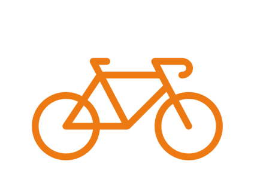
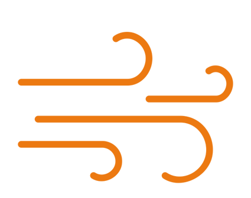

<head>
	
   <meta name="viewport" content="width=device-width, initial-scale=1.0">
    <meta charset="utf-8">
<link rel="stylesheet" href="https://maxcdn.bootstrapcdn.com/bootstrap/4.5.2/css/bootstrap.min.css">
  
  
  
<link rel="stylesheet" href="https://maxcdn.bootstrapcdn.com/bootstrap/4.0.0/css/bootstrap.min.css" integrity="sha384-Gn5384xqQ1aoWXA+058RXPxPg6fy4IWvTNh0E263XmFcJlSAwiGgFAW/dAiS6JXm" crossorigin="anonymous">
	  
<link href="/CatalogoFEMP/stylesheet.css" rel="stylesheet"/>	 
	
    
 
   
    <nav class="navbar navbar-expand-lg navbar-light bg-light">
  <a class="navbar-brand" href="https://opencitydata.github.io/CatalogoFEMP/" style="text-decoration: none;">Catalogue</a>
  <button class="navbar-toggler" type="button" data-toggle="collapse" data-target="#navbarSupportedContent" aria-controls="navbarSupportedContent" aria-expanded="false" aria-label="Toggle navigation">
    
  </button>

  

    <ul class="navbar-nav mr-auto">
	<li class="nav-item">
        <a class="nav-link" href="https://github.com/opencitydata/" style="text-decoration: none;">Open City GitHub</a>
      </li>
	    
	<li class="nav-item">
        <a class="nav-link" href="http://vocab.linkeddata.es/datosabiertos/" style="text-decoration: none;">Open Data Cities</a>
      </li>
      
      <li class="nav-item">
        <a class="nav-link" href="/CatalogoFEMP/contact/" style="text-decoration: none;">Contact</a>
      </li>
      
    </ul>
    <form class="form-inline my-2 my-lg-0">
      <input class="form-control mr-sm-2" type="search" placeholder="Search" aria-label="Search">
      <button class="btn btn-outline-success my-2 my-sm-0" type="submit">Search</button>
    </form>
  

</nav>
  

	
	
<!--	
<nav>

	
    
	

		
<a href="https://opencitydata.github.io/CatalogoFEMP/" style="text-decoration: none;">Catálogo</a>

	

	

	
<a href="http://vocab.linkeddata.es/datosabiertos/" style="text-decoration: none;">Open Data Cities</a>

	

	

	
<a href="https://github.com/opencitydata/" style="text-decoration: none;">Open City GitHub</a>

	

	

	
<a href="/CatalogoFEMP/contact/" style="text-decoration: none;">Contact</a>

	

		
	

     
</nav>
-->
	 
	
	<header>
	

		

  		
  
		<h1 class="h1T">Vocabularios FEMP </h1>
			 
		

			Portal para la catalogación de los conjuntos de datos identificados en la guía de la Federación Española de Municipios y Provincias, emparejando los vocabularios inicialmente creados por la red española de datos abiertos y ciudades inteligentes (OpenCityData).

		

				La Federación Española de Municipios y Provincias o FEMP propuso en el 2019 una iniciativa: crear 40 conjuntos de datos a publicar por Entidades locales. En el 2017 la Federación de Municipios y Provincias de España emitió la guía “Datos abiertos: guía estratégica para su puesta en marcha y conjuntos de datos mínimos a publicar”, que incluye una serie de recomendaciones y lineamientos sobre datos públicos abiertos, entre ellos el propósito de promover su publicación y reutilización. Además de información sobre marcos legales, modelos de gobernanza o mapas estándar de portales de datos abiertos, la guía también incluye 20 conjuntos de datos, que se consideran "el conjunto de datos más interesante, probable y fácil para la administración pública". Debido al gran éxito de FEMP, la idea inicial se amplió a otros 20 nuevos conjuntos. Como resultado se obtiene el archivo: “Datos abiertos FEMP 2019: 40 conjuntos de datos a publicar por las Entidades Locales.” Su objetivo es “proporcionar un modelo de datos abiertos común que facilite la interoperabilidad y la reutilización de la información del sector público, así como acercar a la comunidad internacional la apuesta de los municipios españoles por normalizar la información que se publica en formato abierto.” 
			
		

		

		
 
			 
			  
			<a href="https://datos.gob.es/es/documentacion/datos-abiertos-femp-2019-40-conjuntos-de-datos-publicar-por-las-entidades-locales"> <button type="button" class="btn btn-light buttonI">Guia FEMP</button></a>
			
		

			
		

	

	</header>
  
</head>

<body>
<link href="/CatalogoFEMP/stylesheet.css" rel="stylesheet"/>	
	
  
	

	

	 
	 

  		
  
			   

			  <figure class="imagen">
			  <a href="https://opencitydata.github.io/CatalogoFEMP/agenda/">  
			    <figcaption>Agenda municipal alcaldía y personal directivo</figcaption></a>
			</figure>  
			  

		 
  
		  

			 

			  <figure class="imagen">
			    <a href="https://opencitydata.github.io/CatalogoFEMP/agendaactividades/"> 
			    <figcaption>Agenda de actividades y eventos</figcaption></a>
			</figure> 
			  

		 

		

			 

			  <figure class="imagen">
			   <a href="https://opencitydata.github.io/CatalogoFEMP/aparcamiento/">
			    <figcaption>Aparcamientos públicos</figcaption></a>
			</figure>
			  

		 

		
  
			  

			  <figure class="imagen">
			   <a href="https://opencitydata.github.io/CatalogoFEMP/avisos/">
			     <figcaption>Avisos, sugerencias, quejas y reclamaciones</figcaption></a>
			</figure>
			  

		

		

			 

			  <figure class="imagen">
			   <a href="https://opencitydata.github.io/CatalogoFEMP/bicicleta/"> 
			    <figcaption>Bicicleta pública</figcaption></a>
			    
			</figure>
			  

		 

		

			 

			  <figure class="imagen">
			  <a href="https://opencitydata.github.io/CatalogoFEMP/calidadaire/">
			    <figcaption>Calidad del aire</figcaption></a>
			    
			</figure>
			  

		 

		

			 

			  <figure class="imagen">
			  <a href="https://opencitydata.github.io/CatalogoFEMP/callejero/"> 
			    <figcaption>Callejero oficial del Ayuntamiento</figcaption></a>
			    
			</figure>
			  

		 

		

			 

			  <figure class="imagen">
			  <a href="https://opencitydata.github.io/CatalogoFEMP/censolocales/"> 
			    <figcaption>Censo de locales, actividades, terrazas de hostelería y restauración, y licencias de apertura</figcaption></a>
			    
			</figure>
			  
  
		

		
  
			   

			 <figure class="imagen">
			 <a href="https://opencitydata.github.io/CatalogoFEMP/contaminacionacustica/">
			    <figcaption>Contaminación acústica</figcaption></a>
			</figure>
			  

		 

		

			 

			 <figure class="imagen">
			 <a href="https://opencitydata.github.io/CatalogoFEMP/contrataciones/">
			    <figcaption>Contrataciones, licitaciones y proveedores de servicios municipales</figcaption></a>
			</figure>
			  

		 

		

			 

			 <figure class="imagen">
			<a href="https://opencitydata.github.io/CatalogoFEMP/convenios/"> 
			    <figcaption>Convenios</figcaption></a>
			</figure>
			  

		 

		

			  

			<figure class="imagen">
			<a href="https://opencitydata.github.io/CatalogoFEMP/deudapublica/"> 
			    <figcaption>Deuda pública del ayuntamiento</figcaption></a>
			</figure>
			  

		

		
  
			   

			<figure class="imagen">
			<a href="https://opencitydata.github.io/CatalogoFEMP/equipamiento/"> <figcaption>Equipamientos municipales</figcaption></a>
			</figure>
			  

		 

		

			 

			<figure class="imagen">
			<a href="https://opencitydata.github.io/CatalogoFEMP/trafico/">
			    <figcaption>Tráfico</figcaption></a>
			</figure>
			

		 

		

			 

			 <figure class="imagen">
			 <a href="https://opencitydata.github.io/CatalogoFEMP/instalacionesdeportiva/"> 
			    <figcaption>Instalaciones deportivas</figcaption></a>
			</figure>
			  

		 

		

			 

			 <figure class="imagen">
			<a href="https://opencitydata.github.io/CatalogoFEMP/lugarinteres/"> 
			    <figcaption>Lugar de interés turístico</figcaption></a>
			</figure>
			  

		

 

 <figure class="imagen">
<a href="https://opencitydata.github.io/CatalogoFEMP/poblacion/">
    <figcaption>Padrón municipal: población</figcaption></a>
</figure>
  

		 

		 

 

 <figure class="imagen">
<a href="https://opencitydata.github.io/CatalogoFEMP/presupuesto/">
    <figcaption>Presupuesto municipal y ejecución presupuestaria</figcaption></a>
</figure>
  

		 

		 

 

 <figure class="imagen">
<a href="https://opencitydata.github.io/CatalogoFEMP/puntoacceso/"> 
    <figcaption>Puntos de acceso WIFI públicos</figcaption></a>
</figure>
  

		 
		

 

 <figure class="imagen">
<a href="https://opencitydata.github.io/CatalogoFEMP/transporte/"> 
    <figcaption>Transporte público</figcaption></a>
</figure>
  

 

<figure class="imagen">
<a href="https://opencitydata.github.io/CatalogoFEMP/cartografia/">
    <figcaption>Cartografía municipal</figcaption></a>
</figure>
  

		 

		 

 

<figure class="imagen">
<a href="https://opencitydata.github.io/CatalogoFEMP/accidentes/">
    <figcaption>Accidentes de tráfico</figcaption></a>
</figure>
  

		 

 

<figure class="imagen">
<a href="https://opencitydata.github.io/CatalogoFEMP/contenedores/">
    <figcaption>Contenedores para el reciclaje</figcaption></a>
</figure>
  

		 

  

   

<figure class="imagen">
<a href="https://opencitydata.github.io/CatalogoFEMP/registro/">
    <figcaption>Registro de asociaciones</figcaption></a>
</figure>
  

  

 

<figure class="imagen">
<a href="https://opencitydata.github.io/CatalogoFEMP/alojamiento/">
    <figcaption>Alojamientos, hoteles, alojamientos turísticos y viviendas vacacionales</figcaption></a>
</figure>
  

		 

  

 

<figure class="imagen">
<a href="https://opencitydata.github.io/CatalogoFEMP/agua/">
    <figcaption>Calidad del agua</figcaption></a>
</figure>
  

		 

  

 

<figure class="imagen">
 <a href="https://opencitydata.github.io/CatalogoFEMP/carrilbici/">
    <figcaption>Carriles bici/ vías ciclistas/ calles tranquilas</figcaption></a>
</figure>
  

		 

  

 

<figure class="imagen">
 <a href="https://opencitydata.github.io/CatalogoFEMP/alumbrado/"> 
    <figcaption>Alumbrado público</figcaption></a>
</figure>
  

  

 

<figure class="imagen">
<a href="https://opencitydata.github.io/CatalogoFEMP/subvenciones/">
    <figcaption>Subvenciones</figcaption></a>
</figure>
  

		 

  

 

<figure class="imagen">
<a href="https://opencitydata.github.io/CatalogoFEMP/zonainfantil/">
    <figcaption>Zonas infantiles y zonas de mayores</figcaption></a>
</figure>
  

		 

		   

 

<figure class="imagen">
 <a href="https://opencitydata.github.io/CatalogoFEMP/censoempresa/">  
    <figcaption>Censo de empresas que pagan impuestos o están obligadas en Entidades Locales</figcaption></a>
</figure>
  

		 

  

 

<figure class="imagen">
<a href="https://opencitydata.github.io/CatalogoFEMP/facturas/"> 
    <figcaption>Facturas</figcaption></a>
</figure>
  
  

  

 

<figure class="imagen">
 <a href="https://opencitydata.github.io/CatalogoFEMP/censovehiculos/">
    <figcaption>Censo de vehículos</figcaption></a>
</figure>
  

		 

  

 

<figure class="imagen">
 <a href="https://opencitydata.github.io/CatalogoFEMP/inventario/">
    <figcaption>Inventario de bienes urbanos y rústicos</figcaption></a>
</figure>
  

		 

		   

 

<figure class="imagen">
 <a href="https://opencitydata.github.io/CatalogoFEMP/parque/">  
    <figcaption>Parques y jardines</figcaption></a>
</figure>
  

		 

  

 

<figure class="imagen">
 <a href="https://opencitydata.github.io/CatalogoFEMP/rpt/"> 
    <figcaption>Relación de Puestos de Trabajo(RPT)</figcaption></a>
</figure>
  
  

  
  
   

<figure class="imagen">
 <a href="https://opencitydata.github.io/CatalogoFEMP/licencias/">
    <figcaption>Licencias urbanísticas y de actividad de locales comerciales</figcaption></a>
</figure>
  

		 

		   

 

<figure class="imagen">
 <a href="https://opencitydata.github.io/CatalogoFEMP/residuos/">
    <figcaption>Gestión de residuos</figcaption></a>
</figure>
  

		 

		   

 

<figure class="imagen">
 <a href="https://opencitydata.github.io/CatalogoFEMP/fuentes/"> 
    <figcaption>Fuente de agua de beber</figcaption></a>
</figure>
  

		 

		   

 

<figure class="imagen">
 <a href="https://opencitydata.github.io/CatalogoFEMP/sanciones/"> 
    <figcaption>Sanciones y multas</figcaption></a>
</figure>
  

		 

		   

  

<figure class="imagen">
<a href="https://opencitydata.github.io/CatalogoFEMP/otros/"> 
    <figcaption>OTROS</figcaption></a>
</figure>
  

	

	 
	

</body>

<!--

    &nbsp;&nbsp; &nbsp;&nbsp;&nbsp;
   &nbsp;&nbsp; &nbsp;&nbsp;&nbsp;
   &nbsp;&nbsp; &nbsp;&nbsp;&nbsp;
    &nbsp; &nbsp; 

    &nbsp;&nbsp; &nbsp; &nbsp;&nbsp;&nbsp;
    &nbsp;&nbsp; &nbsp;&nbsp;&nbsp;
       &nbsp;&nbsp; &nbsp; &nbsp;&nbsp;&nbsp;
    &nbsp;&nbsp;

    &nbsp;&nbsp; &nbsp;&nbsp;&nbsp;
    &nbsp;&nbsp; &nbsp;&nbsp;&nbsp;
    &nbsp;&nbsp;   &nbsp;&nbsp;&nbsp;
    &nbsp;&nbsp;   

    &nbsp;&nbsp;  &nbsp;&nbsp;&nbsp;
    &nbsp;&nbsp;  &nbsp;&nbsp;&nbsp;
    &nbsp;&nbsp; &nbsp;&nbsp;&nbsp;
    &nbsp;&nbsp; 

    &nbsp;&nbsp; &nbsp;&nbsp;&nbsp;
    &nbsp;&nbsp; &nbsp;&nbsp;&nbsp;
    &nbsp;&nbsp;  &nbsp;&nbsp;&nbsp;
    &nbsp;&nbsp; 

    &nbsp;&nbsp;  &nbsp;&nbsp;&nbsp;
    &nbsp;&nbsp;  &nbsp;&nbsp;&nbsp;
    &nbsp;&nbsp;  &nbsp;&nbsp;&nbsp;
    &nbsp;&nbsp; 

    &nbsp;&nbsp;  &nbsp;&nbsp;&nbsp;
    &nbsp;&nbsp;  &nbsp;&nbsp;&nbsp;
    &nbsp;&nbsp;  &nbsp;&nbsp;&nbsp;
    &nbsp;&nbsp; 

    &nbsp;&nbsp;  &nbsp;&nbsp;&nbsp;
    &nbsp;&nbsp;  &nbsp;&nbsp;&nbsp;
    &nbsp;&nbsp;  &nbsp;&nbsp;&nbsp;
    &nbsp;&nbsp; 

    &nbsp;&nbsp;  &nbsp;&nbsp;&nbsp;
    &nbsp;&nbsp;   &nbsp;&nbsp;&nbsp;
    &nbsp;&nbsp;   &nbsp;&nbsp;&nbsp;
    &nbsp;&nbsp; 

    &nbsp;&nbsp;   &nbsp;&nbsp;&nbsp;
    &nbsp;&nbsp;   &nbsp;&nbsp;&nbsp;
    &nbsp;&nbsp;  &nbsp;&nbsp;&nbsp;
    &nbsp;&nbsp; 

   

-->

&nbsp; 

&nbsp; 
